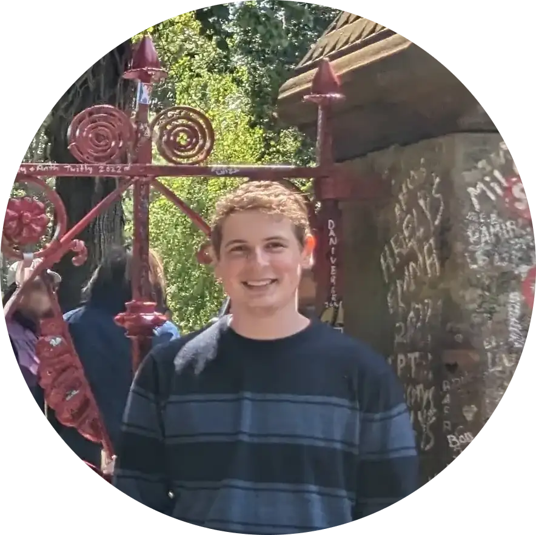

## Hi, I'm Nathan 👋

I'm passionate about programming, technology, and learning new things.
I enjoy working on side projects, tinkering with new technologies, and sharing my knowledge with others.

I'm currently working as a Software Engineer at [Kaluza](https://kaluza.com),
where I'm building software to help energy retailers accelerate the transition to a zero-carbon grid.

I'm a [University of Melbourne](https://unimelb.edu.au) graduate, with a Bachelor of Science in Computer Science and Software Engineering.

I'm always looking for new opportunities to learn and grow, so feel free to reach out if you want to chat or collaborate!

### [Resume](/other/resume.html)

## Links & Socials

- [![Alt][linkedin-logo] LinkedIn][linkedin]
- [![Alt][github-logo] Github][github]
- [![Alt][discord-logo] Discord][discord]
- [![Alt][cults3d-logo] Cults3D][cults3d]
- [![Alt][bgg-logo] BGG][bgg]

[linkedin-logo]: static/images/logos/linkedin.svg "LinkedIn Logo"
[linkedin]: https://www.linkedin.com/in/nathan-doolan-835a13171

[github-logo]: static/images/logos/github.svg "Github Logo"
[github]: https://github.com/NDoolan360

[discord-logo]: static/images/logos/discord.svg "Discord Logo"
[discord]: https://discord.com/users/nothindoin

[cults3d-logo]: static/images/logos/cults3d.svg "Cults3D Logo"
[cults3d]: https://cults3d.com/en/users/ND360

[bgg-logo]: static/images/logos/bgg.svg "BGG Logo"
[bgg]: https://boardgamegeek.com/user/Nothin_Doin
